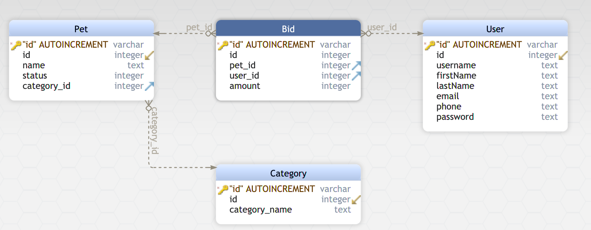

# PetStore + Bidding Option API
## Description
```bash
This API is written in MVC design pattern where the CONTROLLER 
has the routes between the API and the database,
while the MODEL contains all the database and 
the python script for handling the database.

# Database
The database consists of 4 tables: User,Pet,Bid and Category.
```

## For Setup and start
```bash
python3 -m venv .venv
source .venv/bin/activate
pip install -r requirements.txt 
python app.py
```
## Swagger UI
```bash
# Hosted Locally 
http://localhost:5000/swagger/
```
## Testing Functions
```bash
# To Insert a bid, you'll have to insert 
# pet_id(foreign_key),user_id(foreign_key),amount 
# Foreign key constraint is applied ["Post Method]
# Preferably pet_id[1-3] user_id[4-5]
http://localhost:5000/swagger/#/Bids/post_Bids_Insert

# To Get all the Bids ["Get Method"]
http://localhost:5000/Bids/All

# To Get a all bids for specific pet,
# choose pet with "id=1 in example ["Get Method"]
http://localhost:5000/Bids?pet_id=1
```

## Testing with Nose
```bash
# Note: Should have the server up and running before testing
$ nosetests -v tests/app_test.py

Test getting all requests ... ok
Test adding posting request ... ok
Test adding bad post request ... ok
----------------------------------------------------------------------
Ran 3 tests in 0.105s
```